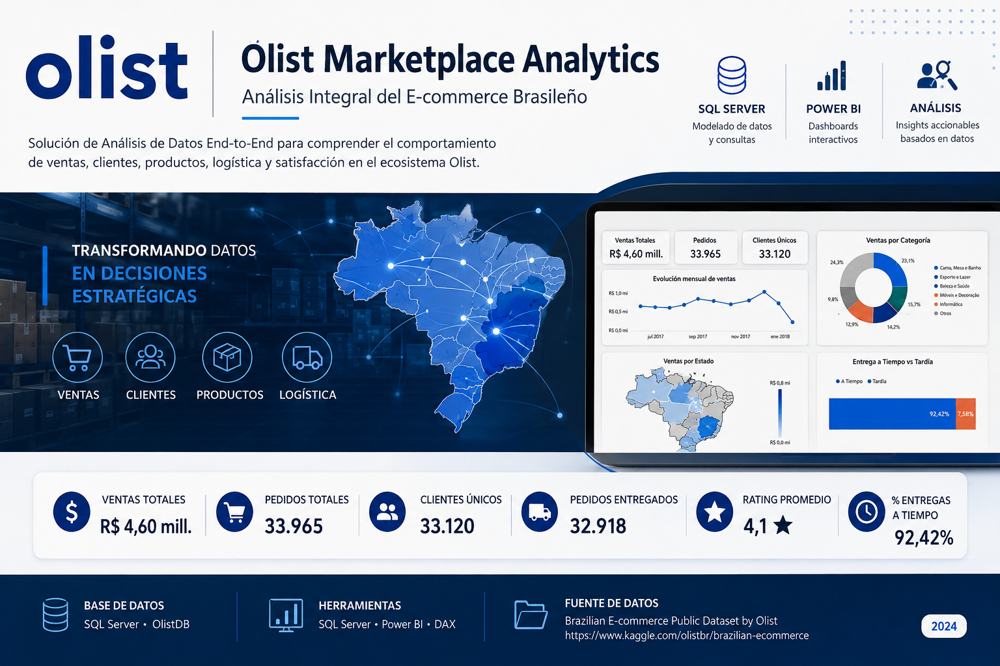
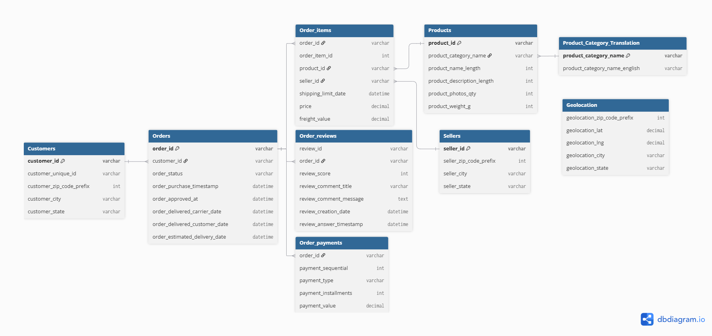
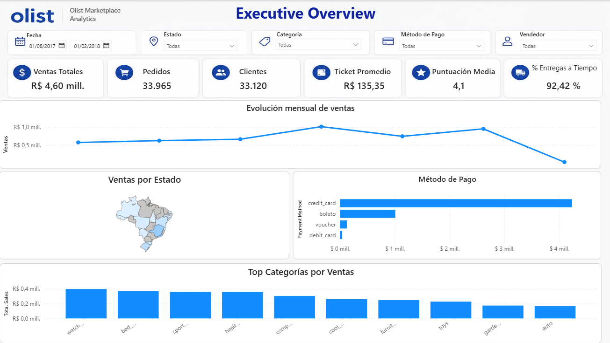
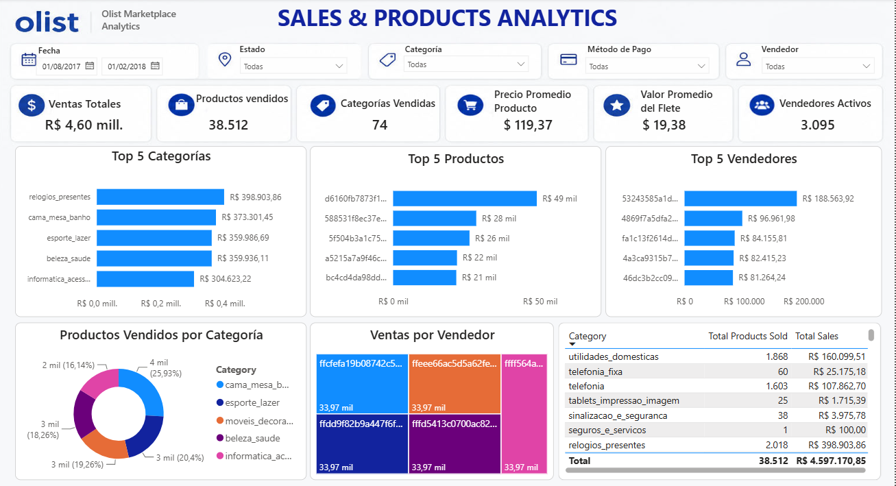
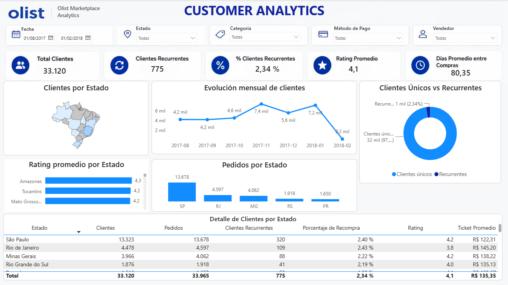
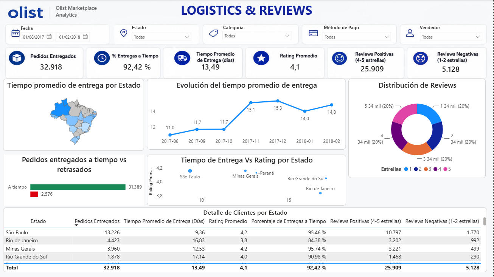

# 📊 Olist Marketplace Analytics



## 🇧🇷 Análisis de datos de e-commerce con SQL Server y Power BI

Proyecto integral de análisis de datos desarrollado sobre el **Olist Brazilian E-Commerce Public Dataset**, con el objetivo de transformar datos transaccionales de un marketplace brasileño en información útil para la toma de decisiones.

El proyecto combina **SQL Server, SQL, Power BI, DAX y modelado de datos**, siguiendo un flujo de trabajo de análisis de extremo a extremo:

> **Datos → SQL Server → Modelado → Limpieza y transformación → Preguntas de negocio → Power BI → Insights**

---

## 🎯 Objetivo del proyecto

El objetivo es analizar el funcionamiento de la plataforma Olist desde diferentes perspectivas:

- Evolución de las ventas.
- Desempeño de productos y categorías.
- Rendimiento de vendedores.
- Comportamiento y recurrencia de clientes.
- Métodos de pago.
- Desempeño logístico.
- Satisfacción de los clientes.
- Relación entre tiempos de entrega y calificaciones.

El proyecto busca demostrar no solo conocimientos técnicos, sino también la capacidad de **convertir datos en preguntas y decisiones de negocio**.

---

# 🛠️ Tecnologías utilizadas

| Tecnología | Uso |
|---|---|
| **SQL Server** | Base de datos, almacenamiento y análisis |
| **SQL** | Consultas, joins, CTE, funciones ventana y análisis de negocio |
| **Power BI** | Visualización e interacción con los datos |
| **DAX** | Medidas, KPIs y cálculos analíticos |
| **Power Query** | Preparación y transformación de datos |
| **GitHub** | Documentación y publicación del proyecto |

---

# 🗄️ Arquitectura del proyecto

El flujo de trabajo utilizado fue:

```text
Dataset Olist
     │
     ▼
SQL Server
     │
     ├── Creación de base de datos
     ├── Creación de tablas
     ├── Importación de CSV
     ├── Claves y restricciones
     └── Vista analítica
     │
     ▼
Preguntas de negocio
     │
     ▼
Power BI
     │
     ├── Modelo de datos
     ├── Tabla calendario
     ├── Medidas DAX
     └── 4 dashboards
     │
     ▼
Insights de negocio
```

---

# 🧩 Modelo de datos

El modelo relacional fue construido en SQL Server y posteriormente utilizado como base para el modelo analítico en Power BI.

Las principales entidades son:

- Clientes
- Pedidos
- Productos
- Categorías
- Vendedores
- Ítems de pedido
- Pagos
- Reseñas
- Geolocalización

### Diagrama ERD



---

# 📂 Estructura del repositorio

```text
Olist-SQL-PowerBI-Analytics/
│
├── README.md
│
├── SQL/
│   ├── 01_Creacion_Base_Datos.sql
│   ├── 02_Creacion_Tablas.sql
│   ├── 03_Importacion_Datos.sql
│   ├── 04_Constraints.sql
│   ├── 05_Views.sql
│   └── Business_Questions.sql
│
├── PowerBI/
│   ├── Olist_Analytics.pbix
│   └── Capturas/
│       ├── Dashboard_1_Resumen_Ejecutivo.png
│       ├── Dashboard_2_Ventas_Productos.png
│       ├── Dashboard_3_Analisis_Clientes.png
│       └── Dashboard_4_Logistica_Reviews.png
│
├── Database_Model/
│   └── ERD.png
│
├── Images/
│   └── cover.png
│
└── Dataset/
    └── dataset_link.txt
```

---

# 🔎 Preguntas de negocio

Las consultas SQL fueron diseñadas para responder preguntas relacionadas con el desempeño comercial, clientes, logística y pagos.

## 1. Evolución mensual de ventas

**Pregunta:**

> ¿Cómo evolucionaron las ventas totales mes a mes y cuál fue el porcentaje de crecimiento o decrecimiento respecto al mes anterior?

### Técnicas utilizadas

- CTE
- `SUM()`
- `LAG()`
- Window Functions
- `NULLIF()`
- `ROUND()`
- Funciones de fecha

### Valor para el negocio

Permite identificar tendencias, períodos de crecimiento, caídas y posibles patrones estacionales.

---

## 2. Top 3 categorías por estado

**Pregunta:**

> En cada estado de Brasil, ¿cuáles son las 3 categorías de productos que generan mayor facturación?

### Técnicas utilizadas

- Múltiples `JOIN`
- `GROUP BY`
- `SUM()`
- `ROW_NUMBER()`
- `PARTITION BY`

### Valor para el negocio

Permite detectar diferencias regionales en las preferencias de compra y apoyar decisiones comerciales y de inventario.

---

## 3. Entregas y satisfacción

**Pregunta:**

> ¿Cuál es la diferencia en el puntaje promedio de las reseñas entre los pedidos entregados a tiempo y los pedidos entregados con retraso?

### Valor para el negocio

Permite analizar la relación entre el desempeño logístico y la satisfacción del cliente.

---

## 4. Clientes recurrentes

**Pregunta:**

> ¿Qué porcentaje de los clientes realizó más de una compra y cuál es el tiempo promedio entre la primera y la segunda compra?

### Técnicas utilizadas

- CTE
- `ROW_NUMBER()`
- `DATEDIFF()`
- Agregaciones
- Subconsultas

### Valor para el negocio

Permite medir la recurrencia y obtener una referencia para estrategias de fidelización y remarketing.

---

## 5. Métodos de pago

**Pregunta:**

> ¿Cómo se distribuyen las ventas según el método de pago utilizado por los clientes?

Se comparan:

- Cantidad de pedidos.
- Facturación total.
- Ticket promedio.

### Valor para el negocio

Permite comprender las preferencias de pago y su peso dentro del negocio.

---

# 👁️ Dashboards de Power BI

El informe se divide en **4 dashboards**, cada uno con una pregunta principal diferente.

---

# 1️⃣ Resumen Ejecutivo

### Pregunta principal

> **¿Cómo está funcionando el negocio?**

### Principales KPIs

- Ventas totales
- Pedidos
- Clientes únicos
- Ticket promedio
- Rating promedio
- % de entregas a tiempo

### Análisis

- Evolución mensual de ventas.
- Ventas por estado.
- Métodos de pago.
- Top categorías.



---

# 2️⃣ Ventas y Productos

### Pregunta principal

> **¿Qué productos, categorías y vendedores impulsan las ventas?**

### Principales KPIs

- Ventas totales
- Productos vendidos
- Categorías activas
- Precio promedio del producto
- Valor promedio del flete
- Vendedores activos

### Análisis

- Top categorías.
- Top productos.
- Top vendedores.
- Ventas por categoría.
- Ventas por vendedor.
- Resumen por categoría.



---

# 3️⃣ Análisis de Clientes

### Pregunta principal

> **¿Quiénes son nuestros clientes y cómo se comportan?**

### Principales KPIs

- Total de clientes.
- Clientes recurrentes.
- % de clientes recurrentes.
- Rating promedio.
- Días promedio entre compras.

### Análisis

- Clientes por estado.
- Evolución mensual de clientes.
- Clientes únicos vs. recurrentes.
- Rating promedio por estado.
- Pedidos por estado.
- Detalle por estado.



---

# 4️⃣ Logística y Reseñas

### Pregunta principal

> **¿Qué tan eficiente es la operación y cómo impacta en la satisfacción del cliente?**

### Principales KPIs

- Pedidos entregados.
- % de entregas a tiempo.
- Tiempo promedio de entrega.
- Rating promedio.
- Reseñas positivas.
- Reseñas negativas.

### Análisis

- Tiempo promedio de entrega por estado.
- Evolución del tiempo de entrega.
- Distribución de reseñas.
- Entregas a tiempo vs. retrasadas.
- Estados con mayor porcentaje de retrasos.
- Relación entre tiempo de entrega y rating.
- Resumen logístico por estado.



---

# 📐 Modelo analítico en Power BI

El modelo de Power BI incluye:

- Tablas transaccionales.
- Relaciones entre dimensiones y hechos.
- Tabla calendario.
- Medidas DAX.
- Filtros interactivos.
- Visualizaciones orientadas a preguntas de negocio.

### Tabla calendario

Se creó una tabla de calendario para permitir análisis temporales y facilitar:

- Evolución mensual.
- Comparaciones temporales.
- Segmentación por período.
- Análisis de tendencias.

---

# 🧮 Medidas DAX

Entre las principales medidas desarrolladas se encuentran:

- Ventas Totales.
- Total de Pedidos.
- Total de Clientes.
- Productos Vendidos.
- Ticket Promedio.
- Rating Promedio.
- Promedio de Entrega.
- % Entregas a Tiempo.
- Categorías Activas.
- Vendedores Activos.
- Precio Promedio del Producto.
- Flete Promedio.
- Clientes Recurrentes.
- % Clientes Recurrentes.
- Días Promedio entre Compras.

---

# 💡 Enfoque analítico

El proyecto busca mantener una separación clara entre:

### SQL Server

Responsable de:

- Almacenamiento.
- Modelado relacional.
- Integridad de datos.
- Consultas de negocio.
- Vista analítica para el análisis de recurrencia.

### Power BI

Responsable de:

- Modelo semántico.
- Medidas DAX.
- Interactividad.
- Visualización.
- Exploración de resultados.

Esta separación permite utilizar SQL para preparar y analizar los datos y Power BI para convertirlos en información visual y accionable.

---

# 📈 Principales KPIs analizados

| KPI | Descripción |
|---|---|
| Ventas Totales | Facturación generada por las ventas de productos |
| Total de Pedidos | Cantidad de pedidos realizados |
| Clientes Únicos | Cantidad de clientes identificados por `customer_unique_id` |
| Ticket Promedio | Valor promedio de un pedido |
| Productos Vendidos | Cantidad de ítems vendidos |
| Categorías Activas | Categorías que participaron en las ventas |
| Vendedores Activos | Vendedores con actividad de ventas |
| Rating Promedio | Promedio de las calificaciones recibidas |
| % Entregas a Tiempo | Porcentaje de pedidos entregados dentro del plazo estimado |
| Clientes Recurrentes | Clientes que realizaron más de una compra |

---

# 🧠 Principales aprendizajes del proyecto

Este proyecto permitió trabajar con un flujo completo de análisis de datos:

- Diseño de una base de datos relacional.
- Creación de tablas y relaciones.
- Importación de archivos CSV UTF-8.
- Manejo de problemas de codificación y formatos.
- Tratamiento de campos de texto y fechas.
- Creación de una vista analítica.
- Consultas SQL orientadas al negocio.
- Modelado de datos en Power BI.
- Creación de medidas DAX.
- Diseño de dashboards ejecutivos.
- Transformación de resultados técnicos en insights de negocio.

---

# 📚 Fuente de datos

**Olist Brazilian E-Commerce Public Dataset**

El dataset contiene información anonimizada de aproximadamente 100.000 pedidos realizados en Brasil.

Fuente:

https://www.kaggle.com/datasets/olistbr/brazilian-ecommerce

También puedes consultar el enlace almacenado en:

```text
Dataset/dataset_link.txt
```

---

# ▶️ Cómo reproducir el proyecto

## 1. Descargar el dataset

Descargar los archivos CSV desde la fuente original de Olist.

---

## 2. Crear la base de datos

Ejecutar:

```text
SQL/01_Creacion_Base_Datos.sql
```

La base de datos utilizada es:

```text
OlistDB
```

---

## 3. Crear las tablas

Ejecutar:

```text
SQL/02_Creacion_Tablas.sql
```

---

## 4. Importar los datos

Ejecutar:

```text
SQL/03_Importacion_Datos.sql
```

> Las rutas de los archivos CSV deben adaptarse a la ubicación local de cada usuario.

---

## 5. Aplicar restricciones adicionales

Ejecutar:

```text
SQL/04_Constraints.sql
```

---

## 6. Crear la vista analítica

Ejecutar:

```text
SQL/05_Views.sql
```

Esta vista se utiliza para analizar el intervalo entre la primera y segunda compra de los clientes.

---

## 7. Ejecutar las preguntas de negocio

Abrir:

```text
SQL/Business_Questions.sql
```

---

## 8. Abrir el informe

Abrir:

```text
PowerBI/Olist_Analytics.pbix
```

---

# ⚠️ Nota sobre el archivo PBIX

El archivo `.pbix` depende de la estructura y conexión utilizada durante el desarrollo.

Si se abre en otro equipo, puede ser necesario actualizar:

- Conexión a SQL Server.
- Ruta de los archivos.
- Credenciales o configuración de acceso a la base de datos.

---

# 👨‍💻 Autor

**Nico Godoy**

Proyecto desarrollado como parte de mi portfolio de análisis de datos.

---

## ⭐ Tecnologías

**SQL Server · SQL · Power BI · DAX · Power Query · GitHub**

---

> **Este proyecto busca demostrar cómo transformar datos transaccionales en información útil para la toma de decisiones mediante SQL y Power BI.**
